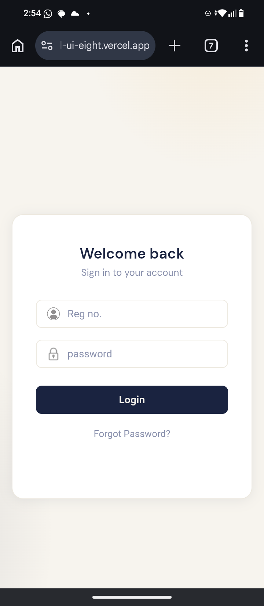
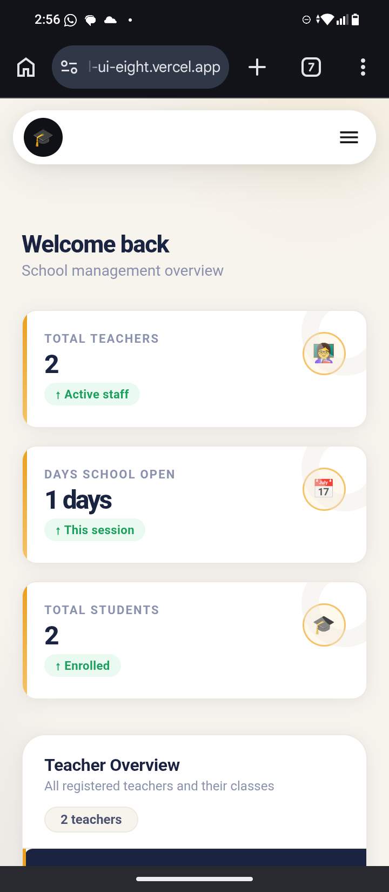
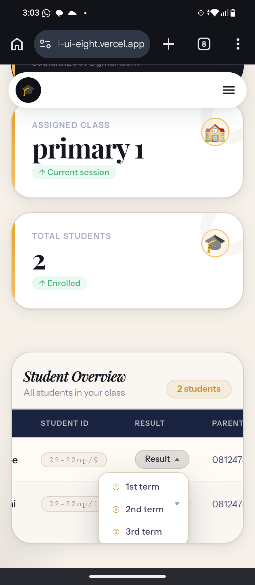
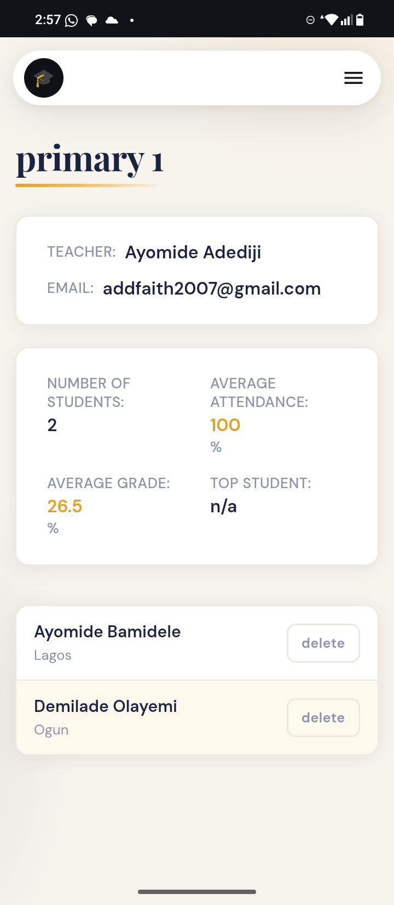

# 🎓 SchoolApp — School Management Backend

A backend service for a school management portal built with **Spring Boot**. It powers a mobile/web frontend that lets **admins** manage teachers and students, and **teachers** manage their classes, attendance, and grades.

> **Live Frontend:** Deployed at `https://school-ui-eight.vercel.app/` (Next.js / React app)  
> **Backend:** Deployed on [Render](https://render.com) as a Java web service

---

## 📱 App Screenshots

### 1. Login Screen
Teachers and admins sign in using their **Registration Number** and **Password**.

> 

---

### 2. Admin Dashboard — School Overview
After login, an admin sees a high-level overview of the school:
- **Total Teachers:** 2 (Active Staff)
- **Days School Open:** 1 day (this session)
- **Total Students:** 2 (Enrolled)
- A **Teacher Overview** section lists all registered teachers and their assigned classes.

> 

---

### 3. Teacher Dashboard — Class Overview
A teacher sees their personal dashboard showing:
- Their **name**, **email**, and **initials avatar**
- Their **assigned class** (e.g. *Primary 1*) — marked as "Current session"
- **Total Students** enrolled in their class

> 

---

### 4. Class Details Page
Clicking into a class shows full details:
- **Teacher name and email**
- **Number of Students**, **Average Attendance %**, **Average Grade %**, **Top Student**
- A list of all enrolled students with their state of origin and a **delete** button

> 

---

### 5. Attendance Table
Teachers can take daily attendance for their class. Each student row shows:
- Student's **full name**
- **Parent's phone number**
- Two action buttons: **Mark Present** (green) and **Mark Absent** (red)

There is also a **Review Attendance** button to see past attendance records.

> 

---

## 🛠️ Tech Stack

| Layer | Technology |
|---|---|
| Language | Java 17 |
| Framework | Spring Boot 3.5.5 |
| Database | PostgreSQL |
| ORM | Spring Data JPA (Hibernate) |
| Security | Spring Security + JWT (JSON Web Tokens) |
| API Docs | SpringDoc OpenAPI (Swagger UI) |
| Validation | Spring Boot Validation |
| Templating | Thymeleaf |
| Build Tool | Maven (via `mvnw` wrapper) |
| Deployment | Render (via `.render.yaml`) + Docker |
| Boilerplate reduction | Lombok |

---

## 🗂️ Project Structure

```
SchoolApp/
├── src/
│   └── main/
│       ├── java/com/example/SchoolApp/   ← All Java source code
│       └── resources/                    ← Config files (application.properties, templates)
├── .github/workflows/                    ← GitHub Actions CI/CD pipeline
├── Dockerfile                            ← Docker container config
├── .render.yaml                          ← Render deployment config
├── pom.xml                               ← Maven dependencies
└── mvnw / mvnw.cmd                       ← Maven wrapper scripts (no Maven install needed)
```

---

## ⚙️ How It Works

### Authentication
- Users (admins and teachers) log in with a **registration number + password**
- The backend validates credentials and returns a **JWT token**
- The frontend stores this token and sends it with every request

### Roles
| Role | What they can do |
|---|---|
| **Admin** | View all teachers, all students, school-wide stats |
| **Teacher** | View their class, manage students, take attendance, record grades |

### Key Features
- ✅ Teacher registration and class assignment
- ✅ Student enrollment with state of origin
- ✅ Daily attendance marking (Present / Absent)
- ✅ Grade tracking and class average calculation
- ✅ Top student detection per class
- ✅ Parent phone number storage per student
- ✅ Session-based school day tracking

---

## 🚀 Running Locally

### Prerequisites
- Java 17 installed
- PostgreSQL running locally
- Git

### Steps

```bash
# 1. Clone the repo
git clone https://github.com/Bigman004/SchoolApp.git
cd SchoolApp

# 2. Set up your PostgreSQL database
# Create a database called: schoolapp (or whatever name you prefer)

# 3. Configure your database connection
# Open: src/main/resources/application.properties
# Update these values:
#   spring.datasource.url=jdbc:postgresql://localhost:5432/schoolapp
#   spring.datasource.username=YOUR_DB_USERNAME
#   spring.datasource.password=YOUR_DB_PASSWORD

# 4. Run the app (no Maven installation needed, the wrapper handles it)
./mvnw spring-boot:run

# On Windows:
mvnw.cmd spring-boot:run
```

The server will start at: `http://localhost:8080`

### API Documentation (Swagger UI)
Once running, open your browser and go to:
```
http://localhost:8080/swagger-ui/index.html
```
This shows all available API endpoints you can test directly in the browser.

---

## 🐳 Running with Docker

```bash
# 1. Build the JAR
./mvnw clean package -DskipTests

# 2. Build the Docker image
docker build -t schoolapp .

# 3. Run the container
docker run -p 8080:8080 \
  -e SPRING_DATASOURCE_URL=jdbc:postgresql://host.docker.internal:5432/schoolapp \
  -e SPRING_DATASOURCE_USERNAME=your_user \
  -e SPRING_DATASOURCE_PASSWORD=your_password \
  schoolapp
```

---

## ☁️ Deploying to Render

The repo includes a `.render.yaml` file that automates deployment.

1. Push this repo to GitHub
2. Log in to [Render](https://render.com) and click **New → Web Service**
3. Connect your GitHub repo — Render will auto-detect `.render.yaml`
4. Add your **environment variables** (database URL, username, password, JWT secret) in the Render dashboard
5. Click **Deploy** — Render will build and start the app automatically

**Build command used by Render:**
```bash
./mvnw clean package -DskipTests
```

---

## 🔑 Environment Variables

| Variable | Description |
|---|---|
| `SPRING_DATASOURCE_URL` | PostgreSQL connection URL |
| `SPRING_DATASOURCE_USERNAME` | Database username |
| `SPRING_DATASOURCE_PASSWORD` | Database password |
| `JWT_SECRET` | Secret key used to sign JWT tokens |
| `JAVA_HOME` | Path to Java 17 (set automatically on Render) |

---

## 📦 Key Dependencies (from pom.xml)

| Dependency | What it does |
|---|---|
| `spring-boot-starter-web` | Handles HTTP requests (REST API) |
| `spring-boot-starter-data-jpa` | Talks to the PostgreSQL database |
| `spring-boot-starter-security` | Protects routes, handles login |
| `jjwt-api / jjwt-impl` | Creates and validates JWT tokens |
| `springdoc-openapi` | Generates Swagger API documentation |
| `spring-boot-starter-validation` | Validates incoming request data |
| `lombok` | Reduces boilerplate (auto-generates getters, setters, etc.) |
| `postgresql` | PostgreSQL JDBC driver |

---

## 👤 Author

**Adediji Ayomide** — [github.com/Bigman004](https://github.com/Bigman004)

---

## 📝 Notes

- This is a **monolithic application** — all features (auth, teachers, students, attendance, grades) live in one Spring Boot project.
- The frontend is a **separate reactjs app** deployed on Vercel, which consumes this backend's REST API.
- JWT tokens are used for stateless authentication — the backend does not store sessions.